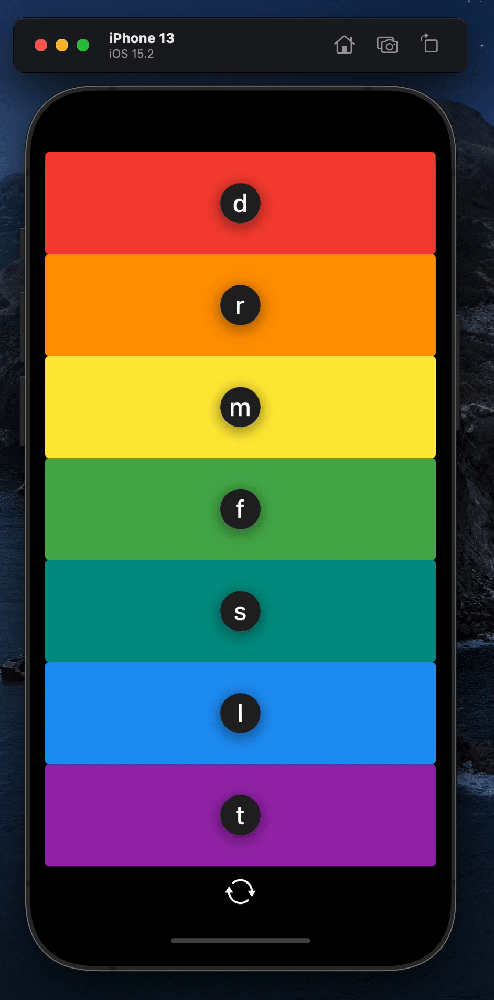

# Xylophone 🎹

Xylophone app that plays Xylophone sounds. Extra features added by me include:
- Note names on xylophone keys
- Change of background color and text color on key press for interactivity
- Refresh button for when sound is no more played

## App screenshot (gif)

## Icon resource
- [Icon8](https://icons8.com/icons/set/refresh)

## Lessons learnt
App built from Complete Flutter Development Bootcamp. Learnt the following by building Xylophone app:
- How to incorporate open source libraries of code into your project using Flutter Packages.
- How to play sound on both iOS and Android.
- How to generate repeated user interface Widgets.
- How to use Dart functions that can take input arguments as well as return an output.
- Dart arrow syntax for writing one line functions.

